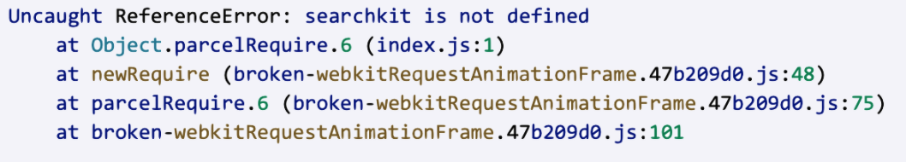

*Question 1*  

 
From: marissa@startup.com  
Subject:  Bad design  

Hello,  
  
Sorry to give you the kind of feedback that I know you do not want to hear, but I really hate the new dashboard design. Clearing and deleting indexes are now several clicks away. I am needing to use these features while iterating, so this is inconvenient.  
   
Thanks,  
Marissa  

Answer:

Hi Marissa,

We appriciate your feedback and are always looking for ways to improve our user experience. Have you tried using the 'Select Page' button? This allows you to select all indexes and provide you the options on the right side to clear or delete multiple indices.

If you are not satisfied with the current workflow, we also provide an API documentation on how you can create your own scripts for the most common programming languages and platforms. Reference: https://www.algolia.com/doc/guides/sending-and-managing-data/manage-your-indices/

Please let me know if these options are acceptable to you. If you are still having issues, I encourage you to provide some more feedback on the new design.

Best,

Peter

  
--

*Question 2*:   
  
From: carrie@coffee.com  
Subject: URGENT ISSUE WITH PRODUCTION!!!!  
  
Since today 9:15am we have been seeing a lot of errors on our website. Multiple users have reported that they were unable to publish their feedbacks and that an alert box with "Record is too big, please contact enterprise@algolia.com".  
  
Our website is an imdb like website where users can post reviews of coffee shops online. Along with that we enrich every record with a lot of metadata that is not for search. I am already a paying customer of your service, what else do you need to make your search work?  
  
Please advise on how to fix this. Thanks.   

Answer:

Hi Carrie,

Thank you for reaching out in regards to this issue. I am sorry that you are experiencing this. 

There are a couple of possibilites on why the error occurred:

1. The records that were sent may still be processing and may take some time to resolve. 

2. Considering that you mentioned that the metadata may not be relevant to search, I would encourage reducing the amount of data that is being enriched. If you absolutely need all of the metadata, consider splitting the records into smaller pieces. You can find more information here: https://www.algolia.com/doc/guides/managing-results/refine-results/grouping/#handling-large-records

3. You may have reached your limit on the service plan. If it's required that you enrich your website with big datasets, you can upgrade your plan by reaching out to enterprise@algolia.com.

Based on the information that you provided, it may seem that possibility number 2 could be the culprit. However, if you feel that you may need more assistance in tackling this issue, I am happy to jump on a call and help diagnose the issue.

Best,

Peter

  
--

*Question 3*:   

From: marc@hotmail.com  
Subject: Error on website  
  
Hi, my website is not working and here's the error:  
  
  
  
Can you fix it please?  

Answer:

Hi Marc,

I am sorry that your website is not working. Based on the image that you provided, it looks like you're trying to use a library outside of Algolia's ecosystem. 

SearchKit is considered part of Elasticsearch's ecosystem. If you already are using Algolia's platform, I would encourage you to use Algolia's library - InstantSearch. We provide a lot of examples and documentation that is available here: https://www.algolia.com/doc/guides/building-search-ui/upgrade-guides/js/#previous-usage 

If you have any additional issues regarding SearchKit, please contact them directly. Please let me know if you have troubles setting up your workspace using Algolia's library.

Best,

Peter

